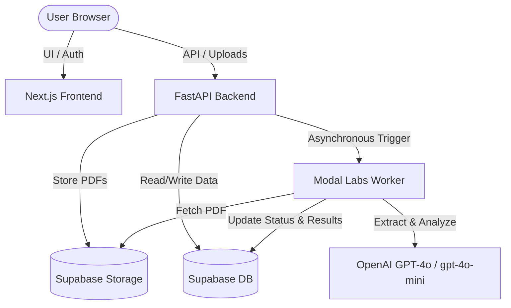

# Deployment Guide: EC Document Analysis & Validation App

This document provides step-by-step instructions to deploy the complete EC Document Analysis application, which consists of:
1. **Supabase Database & Storage**: User authentication, database tables, and PDF document storage.
2. **Modal Labs Serverless Worker**: The heavy computational pipeline converting PDFs to Markdown via MarkItDown and analyzing ownership chains/anomalies via OpenAI GPT models.
3. **FastAPI Backend**: Python gateway deployed as a serverless function on Vercel.
4. **Next.js Frontend**: Web-based user interface deployed on Vercel.

---

## Architecture Overview



---

## Step 1: Database & Storage Setup (Supabase)

1. Sign up/Log in to [Supabase](https://supabase.com/) and create a new project.
2. **Execute Database Schema**:
   * Navigate to the **SQL Editor** in the Supabase dashboard.
   * Open the file [supabase/schema.sql](file:///d:/PROJECTS/ecdouments/supabase/schema.sql) in your editor.
   * Copy the code and run it in the Supabase SQL editor. This creates:
     * `profiles` table (extends standard auth users with role, phone, subscription).
     * `ec_documents` table (stores PDF metadata, upload status, and final JSON analysis reports).
     * `ec_audit_log` table (audit trail for compliance).
     * Row-Level Security (RLS) policies for secure data separation.
     * Triggers for automatic `updated_at` updates.
     * Enablement of Realtime replication on `ec_documents` to push processing updates live.
3. **Execute Seed File**:
   * Copy the contents of [supabase/seed.sql](file:///d:/PROJECTS/ecdouments/supabase/seed.sql) and run it in the SQL Editor.
   * This inserts the required extensions (like `pgcrypto`) and generates three pre-configured test profiles:
     * **Free User**: `test.free@ec-app.in` (Password: `TestFree@2025`)
     * **Premium User**: `test.premium@ec-app.in` (Password: `TestPremium@2025`)
     * **Admin User**: `admin@ec-app.in` (Password: `AdminEC@2025`)
4. **Create Storage Bucket**:
   * Go to the **Storage** section in the Supabase dashboard.
   * Create a new bucket. Name it exactly: `ec-documents`.
   * Keep this bucket **Private** (the FastAPI backend will automatically generate secure signed URLs with short expirations for processing).

---

## Step 2: Modal Labs Worker Setup (Serverless AI Pipeline)

The core analysis pipeline is deployed on Modal Labs to run serverless tasks on-demand without scaling lag or heavy virtual machines.

1. **Install and Configure Modal CLI**:
   Ensure you have a Python environment ready, then install the Modal CLI:
   ```bash
   pip install modal
   ```
2. **Authenticate with Modal**:
   Run the setup utility and follow the browser prompts to log in or create an account:
   ```bash
   modal setup
   ```
3. **Configure Environment Secrets on Modal**:
   Go to your [Modal Settings Dashboard](https://modal.com/) -> **Secrets**, and create two secret groups:
   * **`supabase-secrets`**:
     * `SUPABASE_URL`: Your Supabase project URL (e.g. `https://xxx.supabase.co`).
     * `SUPABASE_SERVICE_ROLE_KEY`: Your Supabase `service_role` key (required to bypass RLS and update tables directly).
   * **`openai-secret`**:
     * `OPENAI_API_KEY`: Your OpenAI API Key.
4. **Deploy the Worker**:
   Run this command from the root of the project:
   ```bash
   modal deploy worker/main.py
   ```
   Modal will compile the Docker container (Debian-based with `markitdown`, `supabase`, `langgraph`, and `openai` dependencies) and deploy the function under the app name `ec-validator-worker`.

---

## Step 3: API & Frontend Deployments (Vercel)

Both components deploy seamlessly to Vercel in a unified step via the `vercel.json` monorepo configuration.

1. **Install Vercel CLI**:
   ```bash
   npm install -g vercel
   ```
2. **Set Up Project Environment Variables**:
   In the Vercel Dashboard for your project, configure the following **Environment Variables**:
   * `SUPABASE_URL`: Your Supabase project URL.
   * `SUPABASE_SERVICE_ROLE_KEY`: Your Supabase `service_role` key.
   * `SUPABASE_JWT_SECRET`: The JWT Secret key found under Supabase API Settings (crucial for verifying cookie auth on backend).
   * `RAZORPAY_KEY_ID`: Razorpay key ID (e.g. `rzp_test_xxxx`).
   * `RAZORPAY_KEY_SECRET`: Razorpay API secret key.
   * `RAZORPAY_WEBHOOK_SECRET`: Razorpay Webhook token.
   * `MODAL_TOKEN_ID`: Your Modal API token ID (allows FastAPI to trigger tasks). Get it via `modal token create` or the Modal settings panel.
   * `MODAL_TOKEN_SECRET`: Your Modal API token secret.
3. **Deploy the Application**:
   Run the following command from the project root:
   ```bash
   vercel --prod
   ```
   * **How it builds**:
     * Vercel builds the Next.js app in the `/frontend` folder.
     * Vercel builds the FastAPI gateway using the Serverless Python runtime at `/api/[[...path]].py`.
     * The routing redirects all request traffic matching `/api/*` to the FastAPI backend while the rest is handled by Next.js.

---

## Step 4: Verification & Local Testing

### 1. Run the Backend Locally:
1. Navigate to the `backend` folder:
   ```bash
   cd backend
   python -m venv .venv
   ```
2. Activate your virtual environment:
   * **Windows**: `.venv\Scripts\activate`
   * **macOS/Linux**: `source .venv/bin/activate`
3. Install Python dependencies:
   ```bash
   pip install -r requirements.txt
   ```
4. Copy/create a `.env` in the root folder with all environment variables.
5. Launch the FastAPI server:
   ```bash
   uvicorn backend.main:app --reload --port 8000
   ```

### 2. Run the Frontend Locally:
1. Navigate to the `frontend` folder:
   ```bash
   cd frontend
   npm install
   npm run dev
   ```
2. Open `http://localhost:3000` in your browser.
3. Next.js proxies request pathways `/api/*` to `http://localhost:8000/api/*` in local development to prevent CORS collisions.

### 3. Integration Check:
1. Log in with the pre-seeded credentials: `test.premium@ec-app.in` / `TestPremium@2025`.
2. Go to the dashboard, upload a digital Encumbrance Certificate PDF, and verify that the status transitions from `queued` -> `downloading` -> `converting` -> `analysing` -> `complete` with real-time UI updates.
